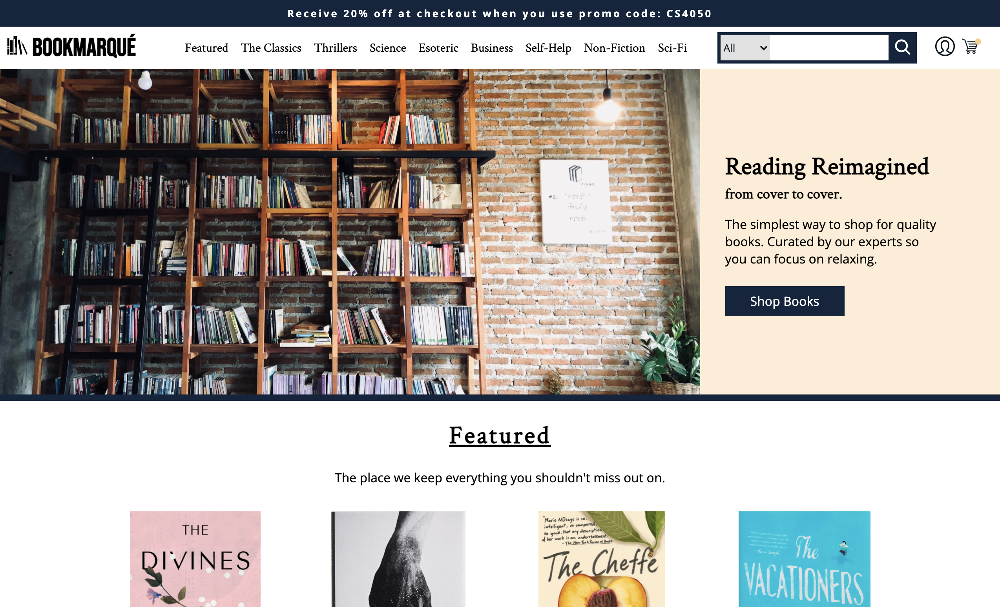

# Bookmarqué



An online bookstore project for a group Software Engineering course. 5 members collaborated over the course of a semester using project management techniques and Agile methodology to create a full-stack MVT product.


Home | Login | Search | Checkout
:-------------------------:|:-------------------------: | :-------------------------: | :-------------------------:
  |   |  | 

## Our Technology
- Flask as the MVT tool and backend server
- Jinja2 template engine
- SQLAlchemy ORM tool
- SCSS
- MySQL
- JavaScript

# Setup

## Flask installation for your machine:
https://flask.palletsprojects.com/en/1.1.x/installation/#installation

## TLDR

- we need to install Flask to use it
- it is good practice to create a virtual environment when working on a Python project
  - essentially it is an isolated copy of Python so you can work on a specific project without worry of affecting other projects/installing different versions of things/etc.
- run the following commands to create and start the venv and then install Flask

(Mac/Linux)
```
$ python3 -m venv venv
$ . venv/bin/activate
$ pip install Flask
```

(Windows)
```
$ py -3 -m venv venv
\> venv\Scripts\activate
$ pip install Flask
```

- to exit venv, you can use `deactivate` from CLI
- to gain access to the virtual environment at a later time you will need to run the activate script again

## Starting a Flask Server
```
$ export FLASK_APP=hello.py or set FLASK_APP=hello.py
$ flask run
```
Now just open the port Flask prints!

See SCSS setup for how this project is run as a package instead of a module.

## Flask Quickstart Tutorial (How to Run the Web Server):
https://flask.palletsprojects.com/en/1.1.x/quickstart/

## SCSS/Mysql Setup
- [Difference between Sass/SCSS](https://www.geeksforgeeks.org/what-is-the-difference-between-scss-and-sass)
- [libsass with Flask](https://sass.github.io/libsass-python/frameworks/flask.html)
- [mysql with Flask](https://www.askpython.com/python-modules/flask/flask-mysql-database)

To start, you'll have to have an active mysql server on your computer. This can be done through various tools such as XAAMP, MySQL Workbench, or PHPMyAdmin, but the end result should be an active server connection. You can find the database SQL file in the repository.

To provide credentials to MySQL, enter configuration details into a `config.py` file using template.

## Installations
```
pip install libsass
pip install flask_mysqldb
pip install flask_login
pip install flask-sqlalchemy
pip install cryptography

export FLASK_APP=bookmarqueapp or set FLASK_APP=bookmarqueapp
flask run
```
